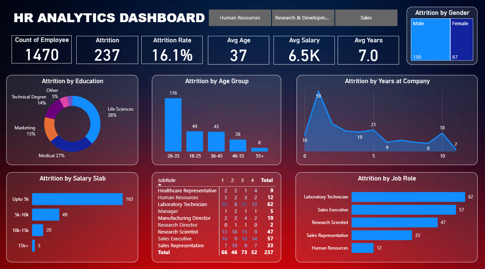

# 📊 HR Analytics Dashboard (Power BI)

This repository contains an **HR Analytics Dashboard** built using **Power BI** to analyze and visualize employee attrition data.  
The dashboard provides key insights to help HR teams understand the factors contributing to employee turnover and make **data-driven retention decisions**.

---

## 🚀 Project Overview

The **HR Analytics Dashboard** presents a comprehensive view of workforce data, focusing on attrition trends by different employee dimensions such as:

- 👥 Age  
- 🚻 Gender  
- 🎓 Education  
- 💰 Salary  
- 💼 Job Role  
- ⏳ Years at Company  

It aims to empower HR professionals with **actionable insights** to identify problem areas and improve employee retention strategies.

---

## 📸 Dashboard Preview

---

## 🎯 Objectives

- Identify the **key factors** influencing employee attrition  
- Understand **demographic and salary-wise** turnover trends  
- Assist HR in improving **employee engagement** and **retention**  
- Provide a **visual summary** of workforce composition and metrics  

---

## 📈 Key Metrics

| Metric | Value |
|--------|--------|
| **Total Employees** | 1,470 |
| **Attrition Count** | 237 |
| **Attrition Rate** | 16.1% |
| **Average Age** | 37 years |
| **Average Salary** | ₹6.5K |
| **Average Tenure** | 7 years |

---

## 🛠️ Tools & Technologies

- 🧩 **Power BI** – Dashboard design and data visualization  
- 📊 **Microsoft Excel / CSV** – Data cleaning and preprocessing  
- 🧮 **DAX (Data Analysis Expressions)** – Calculated fields, KPIs, and measures  

---

## 📚 Learnings

- Gained in-depth experience in **Power BI visualization and DAX**  
- Enhanced **data storytelling** and **HR analytics** understanding  
- Learned to **transform raw workforce data** into actionable insights  

---

